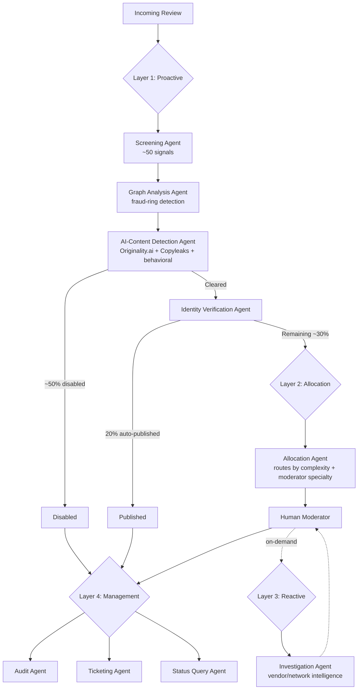

# Trust & Safety AI System

I architected a 9-agent decisioning system that resolves ~70% of content review volume without a human touching it — built and led at Gartner Digital Markets.

 

## The problem

Marketplace reviews were growing faster than the moderation team could keep up with — manual review alone doesn't scale linearly, and spam/fraud slip through the cracks when volume outpaces headcount. We needed something that could catch the obvious cases automatically and only surface the genuinely ambiguous ones to a human.

## What I built

A four-layer pipeline, going from fully autonomous decisions down to human-in-the-loop investigation:

## Illustrative dashboard concept

*Conceptual mockup illustrating how the system's decisions surface to a moderator — not a capture of the actual production interface.*

## Layer by layer

**Layer 1 — Proactive (self-triggered, real-time)**

| Agent | What it does | Autonomous |
|---|---|---|
| Screening Agent | ~50 signals combining reviewer data, third-party enrichment (ZoomInfo firmographic + IPQS IP risk), and behavioral rules. Outputs a disable/clear decision plus a 0–100 complexity score. Batch-run twice daily. | Yes |
| Graph Analysis Agent | Maps shared IP, MAC address, and campaign-tracking signals into a network graph to catch coordinated fraud rings invisible to one-review-at-a-time checks. | Yes |
| AI-Content Detection Agent | Union of Originality.ai + Copyleaks scores combined with internal behavioral signals (typing speed, character patterns) to catch fully AI-generated reviews. | Yes |
| Identity Verification Agent | Cross-references reviewer identity against external digital footprints to confirm authenticity before publishing. | Yes |

Result: ~50% of volume disabled, 20% auto-published — 70% resolved with zero human involvement.

**Layer 2 — Allocation**

The Allocation Agent takes the remaining ~30% and matches each case to the right moderator by complexity and specialty. This replaced a manual 2–2.5 hour daily triage process entirely.

**Layer 3 — Reactive**

The Investigation Agent gives moderators on-demand vendor-, country-, and network-level intelligence when they're working the hardest, most ambiguous cases. Human-triggered, not automatic.

**Layer 4 — Management**

Three smaller agents keep the system honest: an Audit Agent that automates most of what used to be 10–12% manual sampling, a Ticketing Agent that routes ~500 vendor/reviewer tickets a month, and a Status Query Agent that gives internal teams real-time visibility.

## My role

I owned the decision logic and the layered architecture, set the success metrics, and led the build with Engineering — working across Legal, Ombudsman, and Product to get these standards embedded into platform design across four global brands.

## What's not here

This is architecture documentation, not a code repository. The actual implementation belongs to my former employer and isn't mine to publish. What's here reflects the real system design, the real decision logic, and the real numbers — but there's no source code in this repo, and there isn't going to be.

---

*Happy to walk through any part of this design in more depth — the trade-offs behind the layer boundaries, why Screening and Allocation are kept as separate agents, or how the complexity scoring actually works.*
