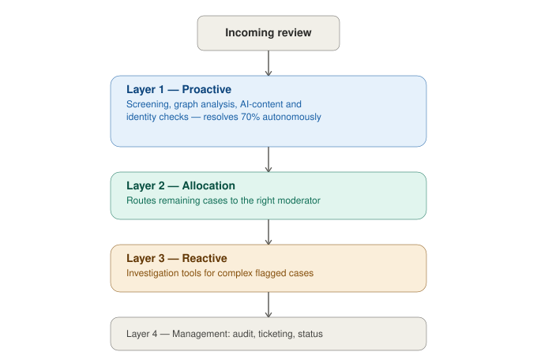
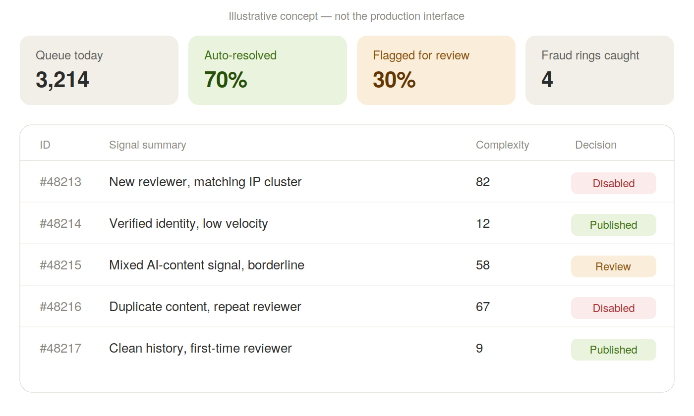
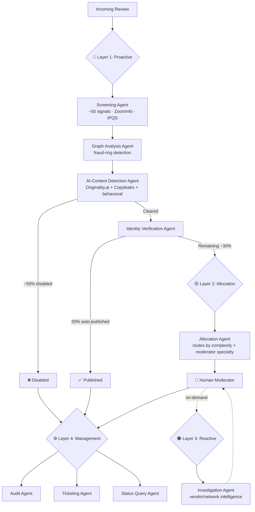

# 🛡️ Trust & Safety AI Agent Suite

**A 9-agent AI decisioning system that autonomously resolves ~70% of content review volume — architected and led at Gartner Digital Markets.**

  

---

## 🧭 Overview

Global software marketplaces process hundreds of thousands of user reviews every month. Left unchecked, spam, fraud, and coordinated bad-actor networks erode buyer trust and catalogue integrity. Manual moderation alone couldn't scale with review volume growth.

I architected and led the build of a **9-agent AI system** combining rule-based automation, ML detection, and agentic decision-making — resolving the majority of review volume autonomously while routing genuinely ambiguous cases to the right specialist moderator.

**Combined result:** ~70% of total review volume resolved autonomously with zero human involvement; the remaining ~30% auto-routed to the right specialist moderator — reducing spam by **90% (USD 3M+ saved annually)** while scaling review throughput from 2K to **100K+ reviews/month**.

---

## ⚡ Impact

| Metric | Result |
|---|---|
| Review volume resolved autonomously | **~70%** |
| Spam reduction | **90%**, saving USD 3M+ annually |
| Review throughput scaled | **2K → 100K+**/month |
| Manual daily triage time eliminated | **2–2.5 hours/day** |
| Audit coverage | Manual 10–12% → **majority automated** |
| Fraud-ring detection | New capability — previously invisible to one-review-at-a-time checks |

---

## Visual overview

## Illustrative dashboard concept

*Conceptual mockup illustrating how the system's decisions surface to a moderator — not a capture of the actual production interface.*

## 🏗️ System Architecture

---

## 🔵 Layer 1 — Proactive (self-triggered, autonomous, real-time)

| Agent | What it does | Autonomous |
|---|---|---|
| **Screening Agent** | Runs ~50 signals combining reviewer data, third-party enrichment (ZoomInfo firmographic + IPQS IP risk data), and behavioral rules. Outputs a disable/clear decision plus a 0–100 complexity score. Batch-run twice daily. | ✅ Yes |
| **Graph Analysis Agent** | Maps shared IP, MAC address, and campaign-tracking signals across reviewers into a network graph to detect coordinated fraud rings invisible to one-review-at-a-time checks. | ✅ Yes |
| **AI-Content Detection Agent** | Union of two third-party AI-detection scores (Originality.ai + Copyleaks) combined with an internal behavioral score (typing speed, character patterns) to catch fully AI-generated reviews. | ✅ Yes |
| **Identity Verification Agent** | Cross-references reviewer identity against external digital footprints (LinkedIn, ZoomInfo, web crawl) to confirm authenticity before auto-publishing. | ✅ Yes |

**Layer 1 result:** ~50% of volume disabled; 20% auto-published — **70% of total volume resolved with zero human involvement.**

---

## 🟡 Layer 2 — Allocation (bridges automation to human judgment)

| Agent | What it does |
|---|---|
| **Allocation Agent** | Matches the remaining ~30% of reviews to the best-suited moderator by complexity type and specialist skill. Replaced a 2–2.5 hour daily manual triage process entirely. |

---

## 🟠 Layer 3 — Reactive (human-initiated, on-demand)

| Agent | What it does |
|---|---|
| **Investigation Agent** | Gives moderators on-demand vendor-, country-, and network-level intelligence reports while investigating the most complex flagged cases. |

---

## ⚙️ Layer 4 — Management Layer (oversight & operations)

| Agent | What it does |
|---|---|
| **Audit Agent** | Automated audit coverage well beyond the prior 10–12% manual sampling, with a 2–3% overturn rate. Feeds a continuous improvement loop back into the other agents. |
| **Ticketing Agent** | Aggregates and auto-routes ~500 vendor/reviewer tickets/month. Auto-resolves simple queries from a knowledge base. |
| **Status Query Agent** | Real-time review-status visibility for internal sales and marketing teams — replacing a slow internal escalation process. |

---

## 🙋 My Role

I architected the agent decision logic and layered system design, defined the success metrics, and led the cross-functional build with Engineering, working across Trust & Safety, Legal, Ombudsman, Engineering, and Product to embed these standards into platform design and enforcement frameworks across four global marketplace brands.

---

## 🔗 Related

This system connects to the revenue layer via shared decision intelligence.
👉 [AI Revenue Case Study](https://github.com/vickybansal99-tech/ai-revenue-case-study)

---

*⚠️ Enterprise-grade systems built within global marketplace operations. Specific tooling and data sources are generalised due to confidentiality.*
